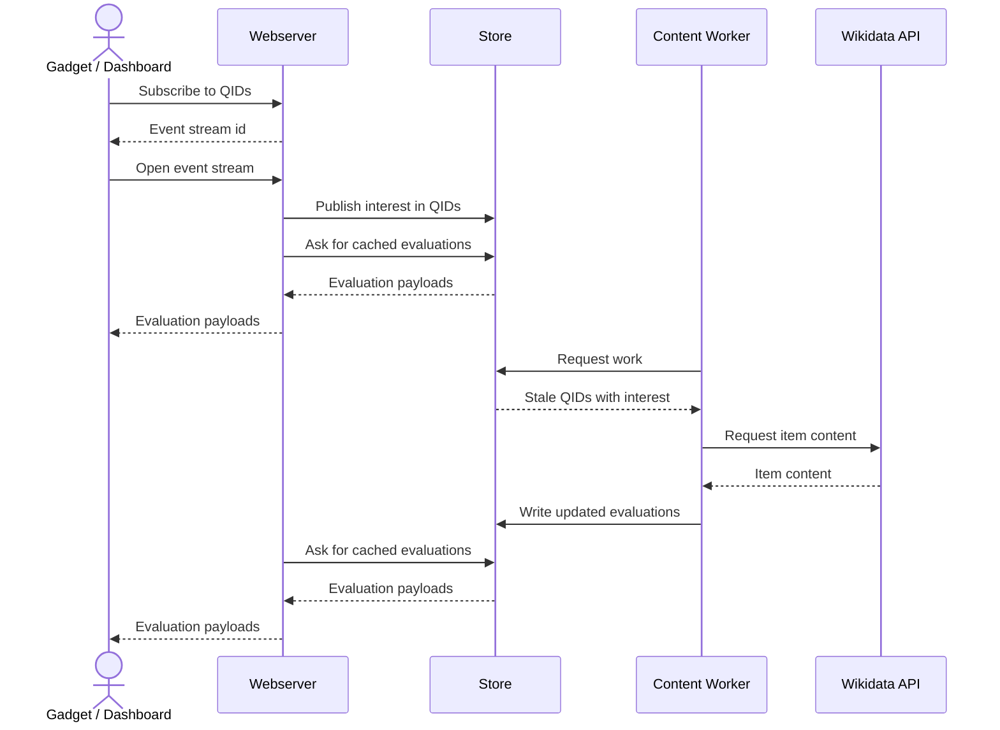
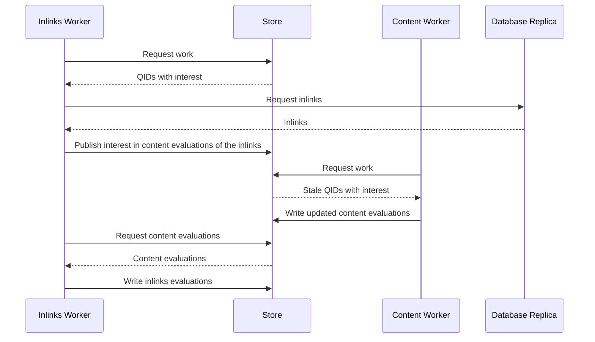

# Data Flow and Caches

This document describes where each detector gets its data from and how the underlying tables are updated.

It is intentionally separate from [detectors.md](detectors.md), which is editor-facing and describes how evidence is judged rather than how the system is implemented.

High level, the dashboard and gadget express interest in items, the backend serves badge data from cache and streams updates back out, and the content, inlinks, and recent-changes workers respond to that interest. The pieces stay loosely coupled so the UI can highlight the current item without having to know which worker will refresh it next.

## Sequence

This is what roughly happens when a gadget wants to show some badges. Only the content worker is shown.

Here is what happens when the inlinks worker looks for work. Gadget and API not shown.

## Evaluation cache

The evaluation cache stores the detector outputs and freshness metadata used by the UI and workers:

- `content_evaluation`
- `recent_changes_cache`
- `inlinks_cache`

`content_evaluation` stores the direct detector outputs:

- `N1`
- `N2a`
- `N2b`
- `redirect_target`

`recent_changes_cache` stores staleness and creation metadata for content rows.

`inlinks_cache` stores inlinks counts, inlinks freshness, and `N3_inlinks`.

Derived values such as `N2`, `N3`, `N12`, and `N` are computed when results are assembled for the UI or for downstream evaluation.

Inlinks counts and linked-item evaluation are joined only when the cache or UI needs them.

## Sources

### Content

Content fetches item data from the Wikidata API with `wbgetentities`.

It provides:

- the entity payload for detectors
- redirect information
- claims and sitelink presence
- delete information
- source URLs for the UI

Content work selection itself is interest-driven. The content worker asks `CACHE.interest` for subscribed rows that need content work. For the exact stale reasons, see [Content worker](content.md).

### Inlinks

Inlinks fetches backlink data from the Wikidata replica.

The source itself only supplies counts and backlink lists. A shared in-memory blackboard holds the active working set, and a small set of coroutines keeps counts, graphs, evaluation, and interest moving together.

For the new coroutines and their queue behavior, see [Inlinks worker](inlinks.md).

### OSM

OSM reads prebuilt usage data from `osm_usage`.

When a QID is present in `osm_usage`, the source sets `N3_osm` to `WEAK`.

### SDC

SDC reads prebuilt Commons structured-data usage from `sdc_usage`.

The cache is built by downloading a TTL dump of Commons SDC and extracting Wikidata ids.

When a QID is present in `sdc_usage`, the source sets `N3_sdc` to `STRONG`.

### Wiki subscribers

Wiki subscribers read from `wiki_subscribers`.

The cache is rebuilt from `wb_changes_subscription` in a ratchet-style process:

- a full rebuild creates a fresh cache from the current table contents
- a follow-up updater polls for new rows and records new QIDs as they are added, but does not detect deletion.

When a QID is present in `wiki_subscribers`, the source sets `N3_wikisub` to `WEAK`.

## Worker behavior

### Foreground requests

Foreground requests run the configured sources in parallel where possible.

### N12 evaluation

The foreground evaluator handles only `N12` work.

It takes queued items, evaluates the configured foreground sources for those items, and writes the resulting N1, N2a, N2b, and freshness data back to the evaluation cache. `N12` is the intrinsic score derived when results are assembled.

The foreground evaluator does not own the N3 sources. Those are handled by separate data refreshers:

- the Content worker owns content data, sitelinks, claims, and the direct N1/N2 criteria
- the Inlinks worker owns the extrinsic `N3_inlinks`
- the OSM, SDC, and wiki-subscriber builders refresh the extrinsic `osm_usage`, `sdc_usage`, and `wiki_subscribers`
- the deletion monitor owns the deletion-log history that feeds content staleness
- the Content worker re-evaluates redirects when the target's content evaluation timestamp is newer than the source evaluation timestamp

### Inlinks worker

The inlinks worker is now interest-driven only.

It polls pubsub interest, refreshes counts, fetches graphs, evaluates linked items, and republishes short-lived interest for the linked QIDs. There is no backfill path.
